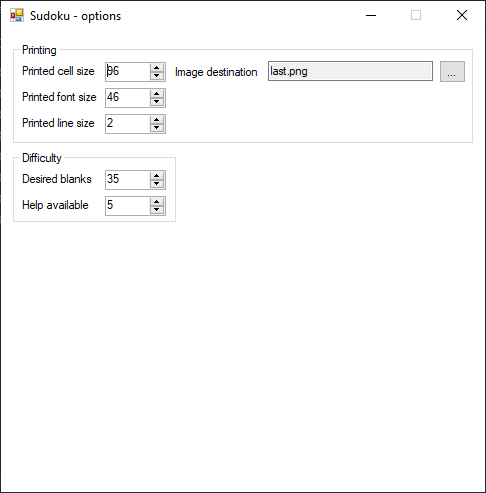

# Sudoku (Windows Forms)

Relatively simple Sudoku application made with C# and Windows Forms

## Installation

The easiest option is to download a compiled version from "Releases" section on the right.

## Usage

Once launched, users will be welcomed with main menu form, which contains four buttons:
- Play (starts a new game)
- Load (loads a previously saved game)
- Options (opens options for user to adjust)
- Exit (Quits the application)

Once a game starts, users will see generated board with certain amount of empty cells, along with the following buttons:
- Save (saves current state of the board)
- Load (loads previously saved game)
- Solve immediately (solves current board using a solver)
- Support me (this fills one cell at a time to assist users)
- To menu (abandons the game and shows the main menu form)
- Save PNG (saves and opens picture of unsolved sudoku)
- Print PNG (prints previously saved picture)

Application contains the following Options possible to change:
- Printed cell size (this is size in pixels of a single sudoku cell)
- Printed font size (size of the font used to draw digits inside of cells)
- Printed line size (size of lines between cells)
- Image destination (where the sudoku is saved for printing)
- Desired blanks (target blank cells application tries to achieve)
- Help available (tells how many times you can receive help during puzzle)

